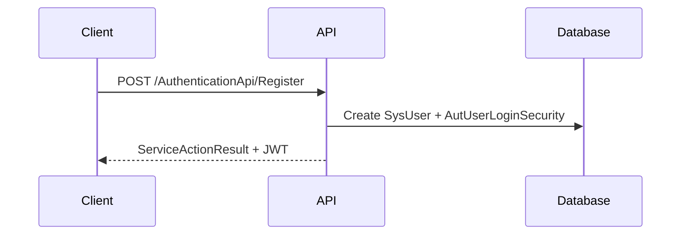
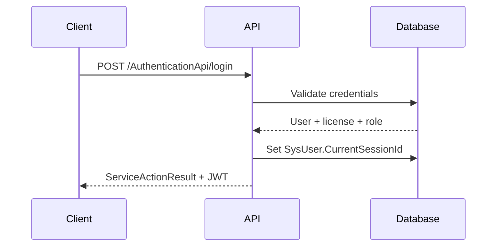
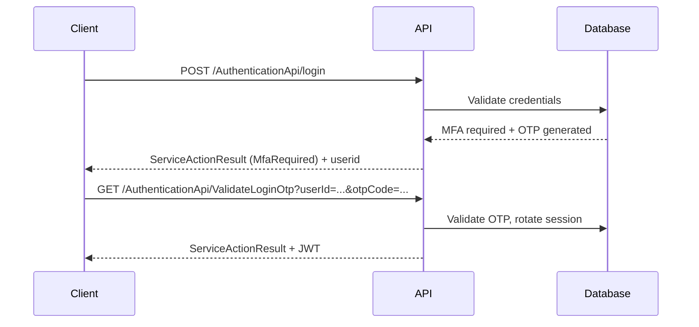
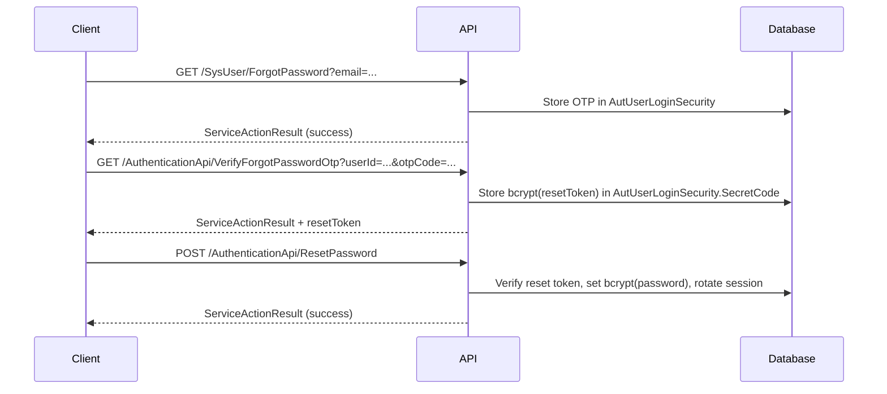
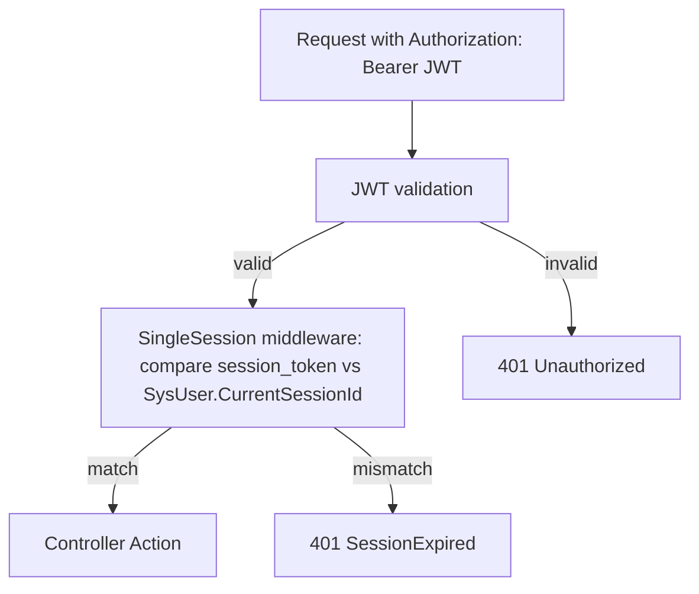

# Authentication System

## Overview
- **Base URL (development)**: `http://localhost:5100`
- Authentication uses JWT Bearer tokens with a server-side session token check (single-session enforcement).
- Passwords are stored using bcrypt hashing; legacy encoded passwords are upgraded to bcrypt on successful login.
- Authentication endpoints are rate-limited to mitigate brute-force and OTP abuse.

## Table of Contents
1. [Authentication Model](#authentication-model)
2. [Authentication Flows](#authentication-flows)
3. [API Endpoints](#api-endpoints)
4. [JWT & Session Management](#jwt--session-management)
5. [Password Reset](#password-reset)
6. [Rate Limiting](#rate-limiting)
7. [Setup](#setup)
8. [Security Best Practices](#security-best-practices)
9. [Troubleshooting](#troubleshooting)

## Authentication Model
- **Token type**: JWT (Bearer)
- **Password storage**: bcrypt
- **Session binding**: JWT includes a `session_token` claim which is validated against `SysUser.CurrentSessionId`.

## Authentication Flows
### Registration


### Login (Standard)


### Login (MFA / OTP)


### Password Reset (OTP -> Reset Token -> New Password)


### Request Authentication (Protected Endpoints)


## API Endpoints

### Summary
| Method | Path | Auth | Rate Limit Policy |
|---|---|---:|---|
| POST | `/AuthenticationApi/ChangeUserTimeZone` | Yes | - |
| POST | `/AuthenticationApi/ftpLogin` | No | `auth-login` |
| POST | `/AuthenticationApi/googleLogin` | No | `auth-login` |
| POST | `/AuthenticationApi/login` | No | `auth-login` |
| GET | `/AuthenticationApi/LoginWithForgotPasswordOtp` | No | `auth-otp` |
| POST | `/AuthenticationApi/logout` | Yes | - |
| POST | `/AuthenticationApi/Register` | No | `auth-register` |
| GET | `/AuthenticationApi/ResendLoginOtp/{userId}` | No | `auth-otp` |
| POST | `/AuthenticationApi/ResetPassword` | No | `auth-password-reset` |
| POST | `/AuthenticationApi/UpdateShowLoginInfo/{id}` | Yes | - |
| GET | `/AuthenticationApi/ValidateLoginOtp` | No | `auth-otp` |
| GET | `/AuthenticationApi/VerifyForgotPasswordOtp` | No | `auth-otp` |
| GET | `/SysUser/ChangePassword` | Yes | `auth-password-reset` |
| POST | `/SysUser/Create` | Yes | - |
| POST | `/SysUser/ForceLogout` | Yes | - |
| GET | `/SysUser/ForgotPassword` | No | `auth-password-reset` |
| GET | `/SysUser/GetAll` | Yes | - |
| GET | `/SysUser/GetByID/{recordid}` | Yes | - |
| GET | `/SysUser/GetUpdateVersion` | No | - |
| GET | `/SysUser/GetUserQRCodeLimit/{userId}` | Yes | - |
| GET | `/SysUser/IsAlreadyExistedEmail` | Yes | - |
| GET | `/SysUser/IsDuplicateUserCode` | Yes | - |
| DELETE | `/SysUser/Remove/{recordid}` | Yes | - |
| POST | `/SysUser/Unban/{recordid}` | Yes | - |
| POST | `/SysUser/UpdateRole/{userId}/{roleId}` | Yes | - |
| POST | `/SysUser/UpdateUserQRCodeLimit` | Yes | - |

### Payload Format
All authentication APIs return a `ServiceActionResult` envelope.

Example (success):
```json
{
  "status": 200,
  "message": "...",
  "resultObject": {
    "token": "<jwt>",
    "userid": "<userId>"
  }
}
```

Example (MFA required):
```json
{
  "status": 4233,
  "message": "MfaRequired",
  "resultObject": {
    "userid": "<userId>",
    "mfaContactInfo": "<masked contact>",
    "OtpExpiredMinute": 5
  }
}
```

### Detailed Endpoint Reference

#### POST `/AuthenticationApi/ChangeUserTimeZone`
- **Auth required**: Yes
- **Parameters**:

| Name | Type | Source |
|---|---|---|
| req | `ChangeTimeZoneDTO` | Body |

Example request body:
```json
{
  "userId": "string",
  "timeZone": "string"
}
```

#### POST `/AuthenticationApi/ftpLogin`
- **Auth required**: No
- **Rate limit policy**: `auth-login`
- **Parameters**:

| Name | Type | Source |
|---|---|---|
| licenseno | `String` | Query/Route |

#### POST `/AuthenticationApi/googleLogin`
- **Auth required**: No
- **Rate limit policy**: `auth-login`
- **Parameters**:

| Name | Type | Source |
|---|---|---|
| req | `GoogleLoginRequestDTO` | Body |

Example request body:
```json
{
  "idToken": "string",
  "localTimeZone": "string"
}
```

#### POST `/AuthenticationApi/login`
- **Auth required**: No
- **Rate limit policy**: `auth-login`
- **Parameters**:

| Name | Type | Source |
|---|---|---|
| req | `LoginRequestDTO` | Body |

Example request body:
```json
{
  "usercode": "string",
  "passcode": "string",
  "localTimeZone": "string"
}
```

Example request:
```bash
curl -X POST "http://localhost:5100/AuthenticationApi/login" \
  -H "Content-Type: application/json" \
  -d "{\"usercode\":\"user@example.com\",\"passcode\":\"P@ssw0rd!\",\"localTimeZone\":\"Asia/Yangon\"}"
```

#### GET `/AuthenticationApi/LoginWithForgotPasswordOtp`
- **Auth required**: No
- **Rate limit policy**: `auth-otp`
- **Parameters**:

| Name | Type | Source |
|---|---|---|
| userId | `String` | Query/Route |
| otpCode | `String` | Query/Route |

#### POST `/AuthenticationApi/logout`
- **Auth required**: Yes
Example request:
```bash
curl -X POST "http://localhost:5100/AuthenticationApi/logout" \
  -H "Authorization: Bearer <jwt>"
```

#### POST `/AuthenticationApi/Register`
- **Auth required**: No
- **Rate limit policy**: `auth-register`
- **Parameters**:

| Name | Type | Source |
|---|---|---|
| req | `RegisterRequestDTO` | Body |

Example request body:
```json
{
  "email": "string",
  "password": "string",
  "userName": "string",
  "phoneNumber": "string",
  "localTimeZone": "string"
}
```

Example request:
```bash
curl -X POST "http://localhost:5100/AuthenticationApi/Register" \
  -H "Content-Type: application/json" \
  -d "{\"email\":\"user@example.com\",\"password\":\"P@ssw0rd!\",\"userName\":\"User\",\"phoneNumber\":\"\",\"localTimeZone\":\"Asia/Yangon\"}"
```

#### GET `/AuthenticationApi/ResendLoginOtp/{userId}`
- **Auth required**: No
- **Rate limit policy**: `auth-otp`
- **Parameters**:

| Name | Type | Source |
|---|---|---|
| userId | `String` | Query/Route |

#### POST `/AuthenticationApi/ResetPassword`
- **Auth required**: No
- **Rate limit policy**: `auth-password-reset`
- **Parameters**:

| Name | Type | Source |
|---|---|---|
| req | `ResetPasswordRequestDTO` | Body |

Example request body:
```json
{
  "userId": "string",
  "resetToken": "string",
  "newPassword": "string"
}
```

Example request:
```bash
curl -X POST "http://localhost:5100/AuthenticationApi/ResetPassword" \
  -H "Content-Type: application/json" \
  -d "{\"userId\":\"<userId>\",\"resetToken\":\"<resetToken>\",\"newPassword\":\"NewP@ssw0rd!\"}"
```

#### POST `/AuthenticationApi/UpdateShowLoginInfo/{id}`
- **Auth required**: Yes
- **Parameters**:

| Name | Type | Source |
|---|---|---|
| id | `String` | Query/Route |

#### GET `/AuthenticationApi/ValidateLoginOtp`
- **Auth required**: No
- **Rate limit policy**: `auth-otp`
- **Parameters**:

| Name | Type | Source |
|---|---|---|
| userId | `String` | Query/Route |
| otpCode | `String` | Query/Route |

#### GET `/AuthenticationApi/VerifyForgotPasswordOtp`
- **Auth required**: No
- **Rate limit policy**: `auth-otp`
- **Parameters**:

| Name | Type | Source |
|---|---|---|
| userId | `String` | Query/Route |
| otpCode | `String` | Query/Route |

#### GET `/SysUser/ChangePassword`
- **Auth required**: Yes
- **Rate limit policy**: `auth-password-reset`
- **Parameters**:

| Name | Type | Source |
|---|---|---|
| userid | `String` | Query/Route |
| oldpassword | `String` | Query/Route |
| newpassword | `String` | Query/Route |

#### POST `/SysUser/Create`
- **Auth required**: Yes
- **Parameters**:

| Name | Type | Source |
|---|---|---|
| _requestData | `SysUserDTO` | Body |

Example request body:
```json
{
  "userId": "string",
  "userCode": "string",
  "userName": "string",
  "lastLogin": "2026-01-01T00:00:00Z",
  "note": "string",
  "departmentId": "string",
  "roleId": "string",
  "roleCode": "string",
  "roleName": "string",
  "email": "string",
  "phoneNumber": "string",
  "positionId": "string",
  "password": "string",
  "locationGroupId": "string",
  "departmentName": "string",
  "locationGroupName": "string",
  "isMobileUser": false,
  "userDeviceList": [{}],
  "profileUrl": "string",
  "timeZone": "string",
  "isMfaEnabled": false,
  "preferredMfaType": "string",
  "mfaContactInfo": "string",
  "licenseId": "string",
  "createdOn": "2026-01-01T00:00:00Z",
  "modifiedOn": "2026-01-01T00:00:00Z",
  "createdByCode": "string",
  "modifedByCode": "string",
  "isMobileLogin": false,
  "status": "string",
  "active": false
}
```

#### POST `/SysUser/ForceLogout`
- **Auth required**: Yes
- **Parameters**:

| Name | Type | Source |
|---|---|---|
| userId | `String` | Query/Route |

#### GET `/SysUser/ForgotPassword`
- **Auth required**: No
- **Rate limit policy**: `auth-password-reset`
- **Parameters**:

| Name | Type | Source |
|---|---|---|
| email | `String` | Query/Route |

#### GET `/SysUser/GetAll`
- **Auth required**: Yes
- **Parameters**:

| Name | Type | Source |
|---|---|---|
| fromDate | `String` | Query/Route |
| toDate | `String` | Query/Route |
| moduleName | `String` | Query/Route |

#### GET `/SysUser/GetByID/{recordid}`
- **Auth required**: Yes
- **Parameters**:

| Name | Type | Source |
|---|---|---|
| recordid | `String` | Query/Route |

#### GET `/SysUser/GetUpdateVersion`
- **Auth required**: No
#### GET `/SysUser/GetUserQRCodeLimit/{userId}`
- **Auth required**: Yes
- **Parameters**:

| Name | Type | Source |
|---|---|---|
| userId | `String` | Query/Route |

#### GET `/SysUser/IsAlreadyExistedEmail`
- **Auth required**: Yes
- **Parameters**:

| Name | Type | Source |
|---|---|---|
| email | `String` | Query/Route |

#### GET `/SysUser/IsDuplicateUserCode`
- **Auth required**: Yes
- **Parameters**:

| Name | Type | Source |
|---|---|---|
| userCode | `String` | Query/Route |

#### DELETE `/SysUser/Remove/{recordid}`
- **Auth required**: Yes
- **Parameters**:

| Name | Type | Source |
|---|---|---|
| recordid | `String` | Query/Route |

#### POST `/SysUser/Unban/{recordid}`
- **Auth required**: Yes
- **Parameters**:

| Name | Type | Source |
|---|---|---|
| recordid | `String` | Query/Route |

#### POST `/SysUser/UpdateRole/{userId}/{roleId}`
- **Auth required**: Yes
- **Parameters**:

| Name | Type | Source |
|---|---|---|
| userId | `String` | Query/Route |
| roleId | `String` | Query/Route |

#### POST `/SysUser/UpdateUserQRCodeLimit`
- **Auth required**: Yes
- **Parameters**:

| Name | Type | Source |
|---|---|---|
| request | `UpdateUserQRCodeLimitRequest` | Body |

Example request body:
```json
{
  "userId": "string",
  "qRCodeLimitPerUser": 0
}
```

## JWT & Session Management
- **JWT claims** include: `userID`, `license`, `session_token`.
- **Single-session enforcement**: when `SysLicense.EnforceSingleSession = true`, requests are rejected if the token’s `session_token` does not match `SysUser.CurrentSessionId`.
- **Logout** invalidates the current session by rotating `SysUser.CurrentSessionId`.

## Password Reset
- **OTP-based reset** is supported via the Authentication module (OTP -> reset token -> reset password).
- Reset tokens are stored as bcrypt hashes to avoid storing usable reset secrets in the database.
- Successful password reset rotates `SysUser.CurrentSessionId` to invalidate existing tokens.

## Rate Limiting
Authentication endpoints use fixed-window limits:
- `auth-login`: 10 requests / minute
- `auth-register`: 5 requests / 10 minutes
- `auth-otp`: 10 requests / 5 minutes
- `auth-password-reset`: 5 requests / 10 minutes

## Setup
### JWT Configuration
Configure JWT in `appsettings.json` (use secrets management in production):
```json
{
  "JwtAuth": {
    "Key": "<long-random-secret>",
    "Issuer": "<issuer>",
    "TokenLifeTime": 180
  }
}
```

### Documentation Auto-Generation
- This file is auto-generated during build when authentication-related source files change.
- To regenerate manually (from the `Smart_QR_API` directory):
```bash
dotnet exec Smart_QR_API/bin/<Configuration>/net8.0/SmartProject_API.dll --generate-auth-docs
```

## Security Best Practices
- Store JWT keys and SMTP/AWS credentials in secrets management (not in source-controlled config).
- Enforce HTTPS and keep `ClockSkew = 0` for strict token expiration.
- Rotate sessions on password change/reset and logout.
- Monitor 429 (rate-limited) and 401 spikes to detect brute-force activity.
- Do not email or log plaintext passwords; use OTP/reset flows.

## Troubleshooting
- **401 Unauthorized**: missing/expired JWT or invalid signature.
- **401 SessionExpired**: token’s `session_token` no longer matches the server-side `SysUser.CurrentSessionId` (logout, password reset, or another login rotated the session).
- **429 Too Many Requests**: auth endpoint rate limit exceeded; slow down retries and use exponential backoff.
- **MfaRequired**: complete OTP validation using `ValidateLoginOtp` before calling protected endpoints.

